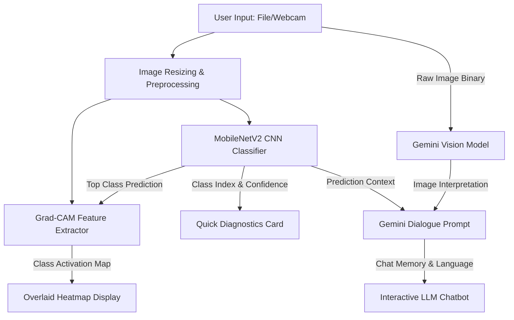

# DermAI Technical Documentation

This document describes the technical architecture, mathematical workflow, and software design of the **DermAI Skin Diagnostics & Medical Assistant Dashboard**.

---

## 🏗️ System Architecture

DermAI utilizes a hybrid architecture combining deep learning classifiers, gradient-based explainable AI, and generative language models. The workflow is diagrammed below:



---

## 🧠 CNN Classification Module

### 1. Model Loading & Preprocessing
The model is loaded dynamically using a resource-cached function to ensure memory optimization:
```python
@st.cache_resource
def load_cnn_model():
    return tf.keras.models.load_model("path/to/model.h5")
```

When an image is received:
1. Resized to `(224, 224)` pixels.
2. Converted to a NumPy float array.
3. Preprocessed using the MobileNetV2 preprocessing convention (scales inputs to range `[-1, 1]`):
   \[ x_{preprocessed} = \frac{x}{127.5} - 1 \]
4. Expanded to batch dimension `(1, 224, 224, 3)`.

### 2. Output Vector
The CNN outputs a softmax probability distribution vector \( P \in \mathbb{R}^7 \):
\[ P(y = c | x) = \frac{e^{z_c}}{\sum_{j=1}^{7} e^{z_j}} \]
where \( z \) represents raw logits of the dense layer, and \( c \) corresponds to one of the 7 target classes.

---

## 🔍 Explainable AI: Grad-CAM Workflow

Grad-CAM identifies the visual areas that contributed most to the CNN's decision. 

### 1. Mathematical Logic
1. **Target Feature Maps:** Let \( A^k \) represent the activation maps of the final convolutional layer of MobileNetV2 (`out_relu` or `Conv_1`). This tensor has shape \( (H, W, K) \) (e.g., \( (7, 7, 1280) \)).
2. **Gradient Tracking:** Let \( y^c \) represent the score for class \( c \) (logit before softmax). We compute the gradients of \( y^c \) with respect to the activation maps \( A^k \):
   \[ \frac{\partial y^c}{\partial A^k} \]
3. **Global Average Pooling of Gradients:** The importance weight \( \alpha_k^c \) of channel \( k \) for class \( c \) is obtained by averaging the gradients over spatial dimensions (width \( W \) and height \( H \)):
   \[ \alpha_k^c = \frac{1}{Z} \sum_{i=1}^{H} \sum_{j=1}^{W} \frac{\partial y^c}{\partial A_{i,j}^k} \]
   where \( Z = H \times W \) is the total number of pixels in the feature map.
4. **Weighted Activation Map:** We perform a weighted combination of forward activation maps and pass it through a Rectified Linear Unit (ReLU) to keep features that positively influence the target class:
   \[ L_{\text{Grad-CAM}}^c = \max\left(0, \sum_{k} \alpha_k^c A^k\right) \]

### 2. Code Implementation
We use TensorFlow's `GradientTape` to compute the gradients dynamically:
```python
# Create a sub-model mapping input -> (last conv activations, final model output)
grad_model = tf.keras.Model(
    inputs=base_model.input,
    outputs=[last_conv_layer.output, base_model.output]
)

with tf.GradientTape() as tape:
    conv_outputs, base_outputs = grad_model(img_array)
    tape.watch(conv_outputs)  # Ensure tracking
    
    # Run predictions through the top sequential classifier layers
    x = base_outputs
    for layer in model.layers[1:]:
        x = layer(x, training=False)
        
    pred_idx = tf.argmax(x[0])
    class_channel = x[:, pred_idx]

# Extract gradients
grads = tape.gradient(class_channel, conv_outputs)
pooled_grads = tf.reduce_mean(grads, axis=(0, 1, 2))
```

The resulting heatmap is normalized to the scale `[0, 1]` and blended with the original RGB image using OpenCV's weighting formula:
\[ \text{Overlay} = \text{Image} \times (1 - \alpha) + \text{Colormap(Heatmap)} \times \alpha \]

---

## 💬 Generative AI Dialogue System

### 1. Multimodal Analysis
When an image is analyzed, the app initiates a query to Google Gemini Vision. The prompt instructs the model to inspect morphological parameters in a structured form:
- Lesion geometry (Asymmetry, Border irregularity)
- Color composition (Pigmentation distribution)
- Textural characteristics (Scaling, ulceration)

### 2. Conversational Chatbot
The chat system leverages Gemini to construct a patient consultation interface. The system updates a history list `st.session_state.chat_history`.
On every question, a prompt is generated carrying context details:
```text
Context:
- CNN Prediction: {predicted_class}
- CNN Confidence: {confidence}%
- Gemini Visual Analysis: {analysis_text}
- User language selection: {selected_language}
- Chat History: {chat_history}
```
This forces Gemini to remain consistent with both the image and the CNN classifications, avoiding hallucinations.

---

## 📊 Patient Analytics Dashboard

- **Data Source:** `dataset/HAM10000_metadata.csv` (10,015 records).
- **Data Preprocessing:** Imputed missing patient age values using the dataset median to prevent chart gaps:
  ```python
  df['age'] = df['age'].fillna(df['age'].median())
  ```
- **Visualization:** Utilizes Plotly Express to render high-contrast, interactive HTML5 graphs. The charts are containerized to dynamically resize based on browser dimensions using Streamlit's `use_container_width=True` configuration.
